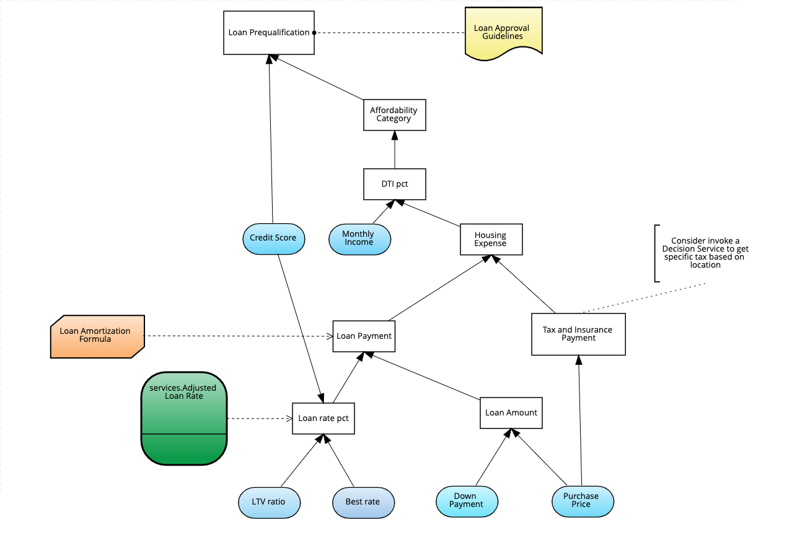

# Loan Pre-qualification

This project is based on the Loan Pre-qualification model used by Bruce Silver in his [DMN Methond & Style book](https://www.amazon.com/Dmn-Method-Style-2nd-Pracitioners/dp/0982368178).

## Loan Prequalification (main DRD)

---

### Adjusted Loan Rate Decision Service (reusable Decision Service DRD)

You can import the project on [Decision Central (RHDM or RHPAM)](https://www.redhat.com/en/technologies/jboss-middleware/decision-manager).

You can also use VSCode with [Kogito Extension](https://marketplace.visualstudio.com/items?itemName=kie-group.vscode-extension-kogito-bundle) which comes with DMN and BPMN editors.